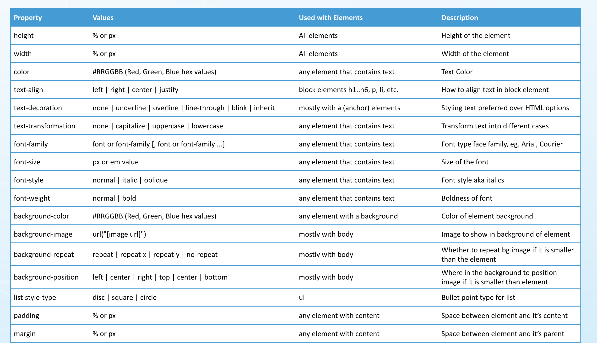
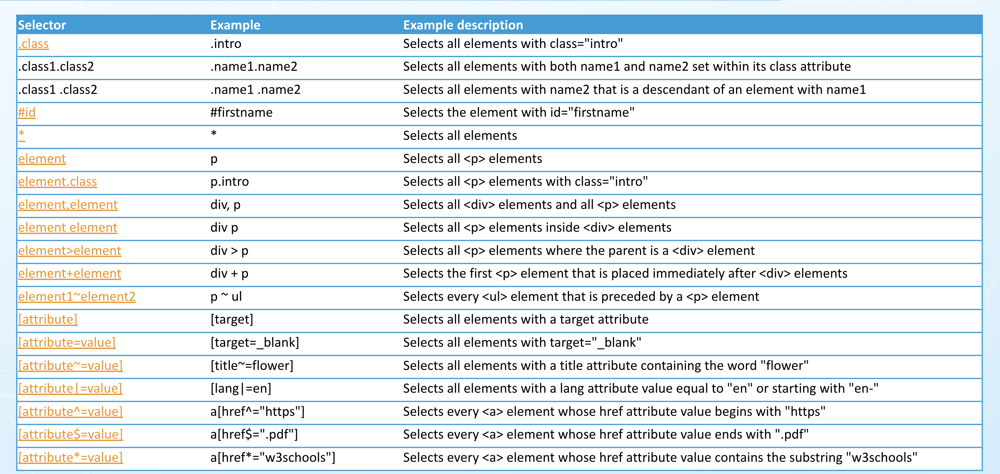

## Class 2
### Create a paragraph with text of your choice.
- Add a "tooltip" to the paragraph with the text "This is a tooltip".
- Style some of the text using of any 3 tags of these tags - bold, italics, strikethrough, underline
- Add an id to the paragraph, “firstParagraph”

### Create two lists - ordered and unordered with items of your choice
- Makes one or two of the items in the list links – Open in new window/tab
- Add a two class to each li item. “class-1” and class-2

### Insert an image in the HTML page and add a alternative text message for image.
- Make it a link too – Open in same tab

Use an anchor tag to open the image in new window.

Make use of any 3 special characters

### Create a table with 3 columns and four rows
- Use proper header for the columns
- Make a cell that spans two columns
- Make a cell that spans 2 rows

### create a new page
- create a new html page beside your index.html
- call it page1.html
- link to this page from index.html
- link to index.html from page1

[https://cmder.com](https://cmder.app/)

## Class 3

<section>
  <h3>Subscription Signup</h3>
  <article>
    
Signup to our weekly newsletter where we will follow a range of topics blah blah blah....

    <form>
Create a form to accept Name, email, Password, telephone number, file upload and a check box for “Receiving promotional Material”, include labels and placeholders 
</form>
  </article>
</section>

### create a navigation menu

- create a navigation menu with links between 2 pages (if you need to create a new page just copy one from previous lecture)

### create a footer
- create an footer on the bottom of the page with the same navigation menu placed within it
- make the footer nav inline and add a search input.
- wrap the search input in a form
- submit the search form to itself using the 'get' method 

## Class 4

#### CSS selectors

#### combining CSS selectors

#### Class work

Using the HTML file and the css file to do the following:
- Add padding, background color and font color to each “section heading” and paragraph
- For “list header” ensure they are underlined
- All ordered list items should be in bold, have a font size of 12px
- All unordered list items should have blue text
- Limit the unordered list height to 100px and width to half the screen width and allow scrolling
