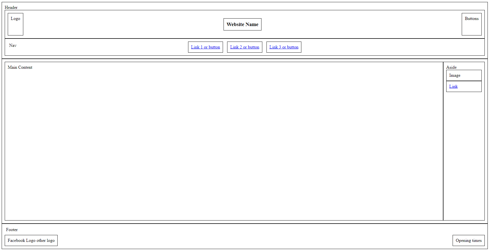

## layout
- Create a header with an image and text and a button
- Use flex to ensure the image is on the left the text is centered and the button is on the right
- Make the button a shade of green
- Make the button a darker shade of green when you hover over it

## create an ordered list and :
- make sure that the background of every second item is lightgrey
- and each <li> has a padding of 5px

## create an unordered list and :
- make sure that the first <li> and the last<li> are bold
- and each item has a padding of 5px; 
- add a margin of 10px to both the Unordered list and the ordered list

## Class 6

- create the following layout using everything we've learnt so far.

in your css file start with 

body {
    height: 100%;
    border: 1px solid grey;
}